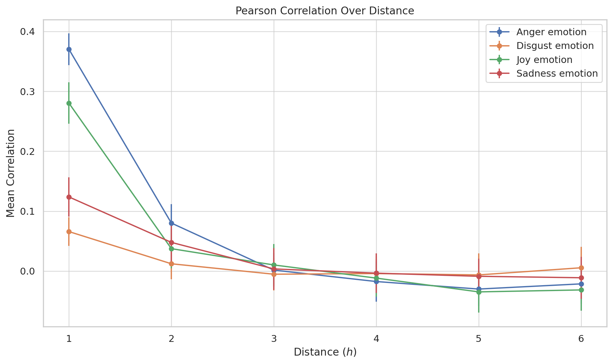
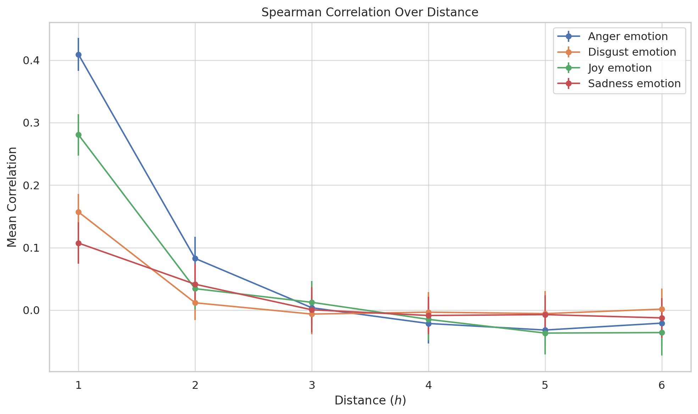

# Emotion-Correlation-Network
This project is to exploring the interplay of emotions within Weibo network. I analyzes dataset consisting of 227,122 lines, where each line represents a connection between two users. It details the number of reposts between users and lists emotional responses—anger, disgust, happiness, and sadness—from the initiating user's tweets.

## 题目描述

1. 阅读本周参考文献。

2. 本周提供的数据文件weibograph.txt共227,122行， 每行表示一条边，即一条用户连接，每行分为四列，第一列和第二列为有连接关系的两个用户，第三列为两用户之间的转发数，即连接强度。 第四列为一个列表，其中数据为第一列用户的情绪计算结果，列表中的四个数值分别为愤怒、厌恶、高兴、悲伤四种情绪微博的数量。例如，文件第一行为0   1   12  [151, 97, 385, 135]，含义如下： 用户0和1之间有连接关系，他们互相转发了12条微博数据。其中，用户0所发布的愤怒、厌恶、高兴和悲伤四种情绪的微博数量分别为151, 97, 385, 135。请利用该文件，尝试计算对于特定距离$h$的用户对之间，不同情绪的相关性，以及该相关性随$h$的变化趋势。

3. （附加）围绕这一数据，你还能想到哪些分析的思路？尝试实现并对结果进行讨论。

## 思路分析

**Step1: 初始化数据库**

函数`initialize_database`初始化MongoDB客户端，清空现有数据，为存储最短路径长度数据做准备。连接到本地的MongoDB数据库，创建一个数据库和集合，并清空集合中的旧数据。以避免内存不足的情况，可以保证程序运行。

**Step2: 加载图数据**

函数 `load_graph`从文件中读取用户之间的连接和情绪数据，构建图结构。读取每一行数据，解析用户ID、连接强度和情绪数据，将这些数据作为节点和边的属性添加到图中。

**Step3: 存储最短路径长度**

函数`store_shortest_path_lengths`计算并存储图中所有节点对之间的最短路径长度。使用NetworkX的`all_pairs_shortest_path_length`方法计算最短路径，然后将每对节点的源节点、目标节点和路径长度存储到MongoDB中。

**Step4: 计算特定距离下的情绪相关性**

函数 `emotion_correlation`对于给定的图距离h，计算所有节点对间的情绪相关性。对每对节点，检查它们之间的路径长度是否等于h，如果是，则记录下他们的情绪数据，最后使用bootstrap方法计算情绪数据的相关性。

## 代码实现

```python
import numpy as np
import networkx as nx
import csv
from pymongo import MongoClient
from scipy.stats import pearsonr
import random

def initialize_database():
    """ Initialize MongoDB client and return collection for shortest paths. """
    client = MongoClient('mongodb://localhost:27017')
    db = client['emotion_network_db']
    collection = db['shortest_paths']
    collection.drop()  # Clear existing data
    return collection

def store_shortest_path_lengths(graph, collection):
    """ Store shortest path lengths of all pairs in MongoDB. """
    for source, path_lengths in nx.all_pairs_shortest_path_length(graph):
        for target, length in path_lengths.items():
            collection.insert_one({'source': source, 'target': target, 'length': length})

def get_path_length(source, target, collection):
    """ Retrieve the shortest path length between two nodes from MongoDB. """
    result = collection.find_one({'source': source, 'target': target})
    return result['length'] if result else None

def bootstrap_correlation(data, bootstrap_samples=10000):
    """ Calculate the mean and standard deviation of bootstrapped correlations. """
    bootstrap_correlations = [pearsonr(*zip(*[random.choice(data) for _ in range(len(data))]))[0] for _ in range(bootstrap_samples)]
    return np.mean(bootstrap_correlations), np.std(bootstrap_correlations)

def emotion_correlation(graph, distance_h, collection):
    """ Calculate emotion correlations for pairs at a specific graph distance. """
    emotions = {emotion: [] for emotion in ['anger', 'disgust', 'joy', 'sadness']}
    for i in graph.nodes():
        for j in graph.nodes():
            if i < j:
                path_length = get_path_length(i, j, collection)
                if path_length == distance_h:
                    for index, emotion in enumerate(emotions):
                        emotions[emotion].append([graph.nodes[i]['emotions'][index], graph.nodes[j]['emotions'][index]])
    
    return {emotion: bootstrap_correlation(data) for emotion, data in emotions.items()}

def load_graph():
    """ Load graph data from a file and initialize nodes with emotions. """
    with open('./Data/weibograph.txt', 'r') as file:
        # Read and parse each line, splitting by tabs and processing emotions embedded in brackets.
        data = []
        for line in file:
            parts = line.strip().split('\t')  # Splitting by tab
            user1, user2, weight = parts[0], parts[1], int(parts[2])
            emotions = list(map(int, parts[3].strip('[]').split(',')))  # Remove brackets and split by comma
            data.append((user1, user2, weight, emotions))
    

    graph = nx.Graph()
    for user1, user2, weight, emotions in data:
        graph.add_edge(user1, user2, weight=weight)
        if 'emotions' not in graph.nodes[user1]:
            graph.nodes[user1]['emotions'] = emotions
        if 'emotions' not in graph.nodes[user2]:
            graph.nodes[user2]['emotions'] = emotions

    return graph

def main():
    """ Main function to process data and store results. """
    graph = load_graph()
    collection = initialize_database()
    store_shortest_path_lengths(graph, collection)
    
    results = {}
    for h in range(1, 7):  # Example distances from 1 to 6
        results[h] = emotion_correlation(graph, h, collection)
    
    with open('./Output/Result.csv', 'w', newline='') as file:
        writer = csv.writer(file)
        headers = ['h'] + [f'{emotion} Correlation, {emotion} Error' for emotion in ['Anger', 'Disgust', 'Joy', 'Sadness']]
        writer.writerow(headers)
        for h, correlations in results.items():
            row = [h] + [value for stats in correlations.values() for value in stats]
            writer.writerow(row)

if __name__ == "__main__":
    main()

```

## 结果与讨论






情绪相关性随距离变化呈现不同的趋势。不同情绪的相关性随用户间距离的变化显示出不同的趋势，其中愤怒和高兴情绪的相关性在距离较短时较强。愤怒情绪在距离1时的平均相关性最高为0.409，而到距离6时降至-0.037。同时，高兴情绪在距离1时也表现出较高的相关性。这表明个体在空间上相近的社交网络中倾向于展示相似程度更高的特定情绪。社交距离较近促进了情绪的同步，人们更可能与距离近的人互动和影响彼此。在处理社交媒体上的情绪影响时，可以根据此设计社交网络干预措施。

不同情绪的相关性稳定性分析中发现，在社交网络中，不同情绪的传播稳定性不同，其中厌恶情绪的相关性变化最为稳定。厌恶情绪的标准偏差最小，平均值在所有距离中波动较小，从0.025至0.034。稳定的相关性表明厌恶情绪在社交网络中的传播受到较少外部因素的影响。可能因为厌恶情绪具有明确且强烈的社交意义，其影响力较为均一和稳定。理解情绪的稳定性有助于更好地管理在线社区的情绪健康和互动。

情绪相关性与社交网络结构的关系角度分析，社交网络的结构对不同情绪的相关性具有明显影响，尤其是在较远的社交距离中。随着距离的增加，所有情绪的相关性普遍降低，但降低的速率和程度因情绪而异。这表明社交网络的连接密度和质量对情绪传播具有重要影响。距离较远的用户可能通过较少的直接交互或较弱的社交纽带相连，这影响了情绪的共鸣和传播。在理解和设计社交网络策略时考虑网络结构的重要性，特别是在针对不同情绪反应的情况下。